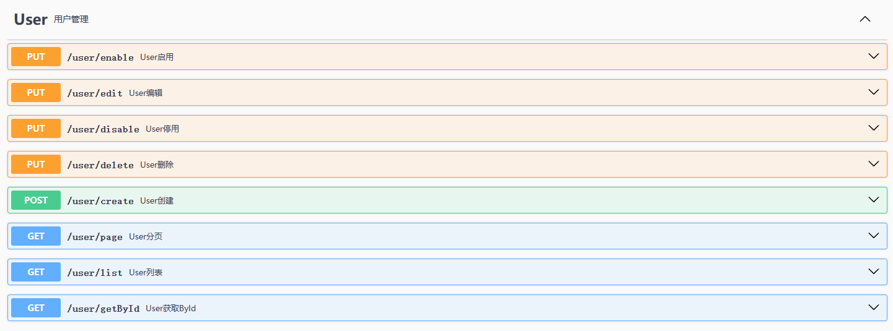

# DDD 最佳实践

基于 DDD 思想的开发框架模板，便于快速启动一个项目，减少前期重复造轮子。

## 目录

- [TODO事项](#TODO)
- [快速启动](#快速启动)
- [项目结构](#项目结构)
    - [Service层](#Service层)
    - [领域事件](#领域事件)
    - [Dao层](#Dao层)

## TODO

- [ ] 链路 requestId 传递
- [x] 异常设计，全局异常处理
- [x] Event 事件处理
- [ ] integration 层 demo
- [x] 用户管理 demo
- [x] dao 层 mybatis-generate 插件
- [ ] 唯一序列号生成数据库版本
- [ ] 分布式锁实现服务
- [ ] 项目脚手架
- [ ] 文档补充
    - [x] 项目结构
    - [ ] service 层设计，processor 设计
    - [ ] 事件设计，包含一致性

## Quick start

#### 启动项目

``` bash
# 1.本地创建数据库表

CREATE TABLE `user` (
  `id` int(11) NOT NULL AUTO_INCREMENT COMMENT '主键',
  `user_id` varchar(32) NOT NULL COMMENT '业务主键',
  `name` varchar(64) DEFAULT NULL COMMENT '名称',
  `password` varchar(1024) DEFAULT NULL COMMENT '密码',
  `phone` varchar(64) DEFAULT NULL COMMENT '电话',
  `avatar` varchar(64) DEFAULT NULL COMMENT '头像',
  `status` varchar(32) NOT NULL COMMENT '状态',
  `server_create_time` timestamp(3) NOT NULL DEFAULT CURRENT_TIMESTAMP(3) COMMENT '服务器创建时间 : 服务器创建时间',
  `server_update_time` timestamp(3) NULL DEFAULT CURRENT_TIMESTAMP(3) ON UPDATE CURRENT_TIMESTAMP(3) COMMENT '服务器更新时间 : 服务器更新时间',
  PRIMARY KEY (`id`),
  UNIQUE KEY `idu_user_id` (`user_id`),
  KEY `idx_phone` (`phone`)
) ENGINE=InnoDB AUTO_INCREMENT=3 DEFAULT CHARSET=utf8mb4 COMMENT='系统用户'

# 2.修改 application.yml 对应的数据库连接配置
# 3.编译启动项目，项目基于 java17

cd ddd
mvn clean install
java -jar ddd-start-0.0.1-SNAPSHOT.jar
#能顺利编译并运行成功即可

#目前暂无项目脚手架，需要自行修改项目名称、module、包名、相关pom文件
```

### 文档说明

项目自带 swagger
文档，启动项目后浏览器打开 [http://localhost:8080/swagger-ui/index.html](http://localhost:8080/swagger-ui/index.html#/)



项目以用户管理为示范，实现了用户的创建、编辑、删除、启用、停用、主键查询、列表查询、分页查询接口

## 项目结构


| module          | 职责                                                                   |
|-----------------|----------------------------------------------------------------------|
| ddd-bean        | 主要是 DTO，请求的入参和回参结构体                                                  |
| ddd-start       | 负责 spring 项目启动                                                       |
| ddd-web         | http api 实现，此 Module 为非必须，与 ddd-client 二选一或者都要                       |
| ddd-client      | RPC 的 client，可以是 feign，可以是 dubble，此 Module 为非必须，与ddd-client-impl同时出现 |
| ddd-client-impl | RPC 的 client 的实现,此 Module 为非必须,与 ddd-client 同时出现                     |
| ddd-service     | 业务服务层，各个领域对外提供的接口，ddd-client-impl 和 ddd-web 的请求都汇聚于此                 |
| ddd-core        | 领域核心层                                                                |
| ddd-integration | 外部对接层，外部依赖防腐层                                                        |
| ddd-dao         | 外部对接层，外部依赖防腐层                                                        |
| ddd-common      | 公共层                                                                  |

### Service层

所有业务交由 Processor 处理，业务 Processor 应该继承 AbstractProcessor，整体采用模板模式设计，AbstractProcessor 统一处理事务和事件

业务 Processor 采用注解自动注册到 BizProcessorComponent

### 领域事件

Processor 业务处理完成后可触发领域事件，一个 Processor 可以发送多个领域事件，一个领域事件可以被多个事件 Handle 处理

领域事件可分三类：同步事件，异步事件

事件 handle 采用注解自动注册到 BizEventHandleComponent

##### 同步事件

由处理业务 Processor 的线程一并处理，为满足一致性需求，事件 handle 的事务和业务的事务是包裹在同一个事务中

也就是说事件 handle 的异常会导致整个事务回滚，同时同步事件 handle 处理不应该很大，应该尽可能精简，如无法满足可考虑异步事件
Handle， 参考
AbstractSyncEventHandle

##### 异步事件

由统一的线程池处理，当业务事务执行完成后执行异步事件 handle，业务和事件 handle 无法满足一致性要求，目前是通过重试达成最终一致性，参考
AbstractAsyncEventHandle

### Dao层

数据库层，查询保存领域数据

结合 MybatisGenerator 自动代码生成，MybatisGenerator
的插件编写参考 [mybatis-generator-plugin](https://github.com/itfsw/mybatis-generator-plugin)
